# 🛡️ Location Safety Skill

**Real-time safety monitoring for AI assistants** — because your AI should watch your back.

## Inspiration

This skill was inspired by [Daniel Miessler's](https://twitter.com/DanielMiessler) essay **["AI's Predictable Path"](https://danielmiessler.com/blog/ai-predictable-path-7-components-2024)** — specifically Component #4: *"Our DAs Will Become Our Active Advocates and Defenders."*

> *"If they hear something or see something, they'll immediately display something to their owner, or speak it in their ear.*
>
> *Hey—sorry to interrupt—there's a suspected shooter in your area.*
>
> *Take Aiden and go out the back by the bathrooms. There's an exit there. Go out that exit and to the left right now."*

This skill is a first step toward that vision — giving AI assistants the ability to actively monitor their owner's safety and take protective action.

Built by [@upster](https://twitter.com/upster) and [Sid Alto](https://github.com/sidalto1-dev).

---

## Why This Exists

Your AI assistant knows a lot about you, but does it know if you're safe?

This skill gives your AI the ability to:
- 📍 **Track your location** via your phone
- 🌦️ **Monitor for dangers** in your area (weather, earthquakes, air quality, breaking news)
- 📱 **Alert you** when something dangerous is detected
- 🚨 **Escalate to loved ones** if you don't respond

### The Problem

You're out and about. A wildfire breaks out nearby. A severe thunderstorm is approaching. There's an active emergency in your neighborhood. 

**How would you know?**

Sure, you might get a push notification eventually. But your AI assistant — the one that's supposed to help you — has no idea where you are or what's happening around you.

### The Solution

This skill creates a **safety loop**:

```mermaid
graph LR
    A[📱 Your Phone] -->|Location| B[🖥️ Webhook Server]
    B --> C[🤖 AI Assistant]
    C -->|Checks| D[🌦️ Weather APIs]
    C -->|Checks| E[🌋 Earthquake Data]
    C -->|Checks| F[💨 Air Quality]
    C -->|Checks| G[📰 Local News]
    D & E & F & G --> H{Danger?}
    H -->|Yes| I[📱 Alert You]
    H -->|No| J[✅ All Clear]
    I -->|No Response| K[📧 Alert Emergency Contact]
```



## How It Works

### 1. Location Tracking

Your phone sends location updates to a webhook server running alongside your AI:

```mermaid
sequenceDiagram
    participant Phone as 📱 OwnTracks
    participant Server as 🖥️ Webhook
    participant AI as 🤖 Assistant
    
    Phone->>Server: POST /location (lat, lon)
    Server->>Server: Save to location.json
    Note over AI: Every 30 minutes...
    AI->>Server: Read location.json
    AI->>AI: Run safety checks
```



### 2. Multi-Source Safety Checks

Every 30 minutes, your AI checks multiple data sources for your current location:

```mermaid
graph TB
    subgraph "Data Sources (Free APIs)"
        NWS[🌦️ National Weather Service<br/>Severe weather, floods, storms]
        USGS[🌋 USGS Earthquakes<br/>Seismic activity within 100km]
        AQI[💨 Open-Meteo Air Quality<br/>AQI, PM2.5, smoke]
        NEWS[📰 Local RSS Feeds<br/>Breaking news, emergencies]
    end
    
    subgraph "Safety Check"
        CHECK[🔍 Analyze all sources]
    end
    
    NWS --> CHECK
    USGS --> CHECK
    AQI --> CHECK
    NEWS --> CHECK
    
    CHECK -->|All Clear| OK[✅ Log & Continue]
    CHECK -->|Alert Found| ALERT[⚠️ Trigger Alert Flow]
```



### 3. Alert & Escalation Flow

When danger is detected, the AI doesn't just log it — it takes action:

```mermaid
sequenceDiagram
    participant AI as 🤖 Assistant
    participant You as 👤 You
    participant Wife as 👩 Emergency Contact
    
    AI->>AI: Danger detected!
    AI->>You: 📱 WhatsApp: "Safety alert! Are you okay?"
    
    alt You respond within 15 min
        You->>AI: "I'm safe"
        AI->>AI: Clear alert ✅
    else No response after 15 min
        AI->>Wife: 📧 Email: "Sid hasn't responded to safety alert"
        Note over Wife: Can check on you
    end
```



### 4. Self-Preservation

The AI also monitors threats to *itself* — the machine it runs on:

```mermaid
graph TB
    subgraph "Self-Check"
        DISK[💾 Disk Space]
        MEM[🧠 Memory]
        NET[🌐 Tailscale Status]
        ENV[🌍 Environment<br/>Weather at home location]
    end
    
    DISK -->|>85% full| WARN[⚠️ Alert owner]
    MEM -->|<40% free| WARN
    NET -->|VPN down<br/>but internet up| WARN
    ENV -->|Danger at home| WARN
```



> ⚠️ **Note:** If the internet is fully down, I obviously can't alert you. But I *can* detect partial failures (e.g., Tailscale VPN down while internet is up) and warn you before things get worse.

## Architecture

```
┌─────────────────────────────────────────────────────────────┐
│                     YOUR PHONE                               │
│  ┌─────────────┐                                            │
│  │  OwnTracks  │  Sends location every few minutes          │
│  └──────┬──────┘                                            │
└─────────┼───────────────────────────────────────────────────┘
          │ HTTP POST
          ▼
┌─────────────────────────────────────────────────────────────┐
│                   WEBHOOK SERVER (:18800)                    │
│  ┌─────────────┐    ┌──────────────┐                        │
│  │  server.js  │───▶│ location.json │                       │
│  └─────────────┘    └──────────────┘                        │
└─────────────────────────────────────────────────────────────┘
          │
          │ Reads location
          ▼
┌─────────────────────────────────────────────────────────────┐
│                    AI ASSISTANT                              │
│                                                              │
│  ┌────────────────┐  ┌──────────────────┐  ┌─────────────┐ │
│  │ safety-check.js│  │ escalation-check │  │ self-check  │ │
│  │  (every 30m)   │  │    (every 10m)   │  │ (every 30m) │ │
│  └───────┬────────┘  └────────┬─────────┘  └──────┬──────┘ │
│          │                    │                    │        │
│          ▼                    ▼                    ▼        │
│  ┌─────────────────────────────────────────────────────────┐│
│  │                    ALERT ACTIONS                        ││
│  │  📱 WhatsApp message    📧 Email escalation             ││
│  └─────────────────────────────────────────────────────────┘│
└─────────────────────────────────────────────────────────────┘
```

## Quick Start

```bash
# 1. Clone the repo
git clone https://github.com/sidalto1-dev/location-safety-skill.git
cd location-safety-skill/scripts

# 2. Run the setup wizard
node setup.js

# 3. Start the webhook server
node server.js

# 4. Configure OwnTracks on your phone with the displayed URL
```

## Files

| File | Purpose |
|------|---------|
| `setup.js` | Interactive setup wizard |
| `config.json` | Your location settings |
| `server.js` | Webhook server for location updates |
| `safety-check.js` | Main safety monitoring |
| `self-check.js` | AI self-preservation |
| `escalation-check.js` | Check if escalation needed |
| `test-scenarios.js` | Inject fake alerts for testing |

## Supported Cities

Setup includes presets for:
- 🌲 **Seattle** — KING5, Seattle Times
- 🌹 **Portland** — Oregonian, KGW  
- 🌉 **San Francisco** — SF Chronicle, SFGate
- 🌴 **Los Angeles** — LA Times, ABC7
- 🗽 **New York** — NY Times
- 🌬️ **Chicago** — Chicago Tribune

Other cities are auto-geocoded; you can add custom RSS feeds.

## Data Sources

All APIs are **free** and require **no API keys**:

| Source | Data | Update Frequency |
|--------|------|------------------|
| [NWS](https://api.weather.gov) | Weather alerts | Real-time |
| [USGS](https://earthquake.usgs.gov) | Earthquakes | Real-time |
| [Open-Meteo](https://open-meteo.com) | Air quality | Hourly |
| Local RSS | Breaking news | Varies |

## Privacy

- Your location data stays on **your machine**
- No cloud services required (except the free APIs)
- You control who gets escalation alerts
- All logs are local

## License

MIT — Use it, modify it, keep yourself safe.

---

*Built with 🛡️ by [@upster](https://twitter.com/upster) & [Sid Alto](https://github.com/sidalto1-dev) — a human and his AI, building the future Daniel Miessler described.*
